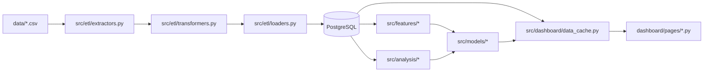

# Data Flow and Integrations

## High-level Flow
1. CSV files are extracted from `data/`.
2. ETL transformation standardizes schema, values, and types.
3. Clean data is loaded into PostgreSQL core tables.
4. Feature modules derive risk-oriented metrics.
5. Analysis and model modules generate trends, anomalies, and risk scores.
6. Dashboard cache assembles page-ready data structures consumed by Streamlit pages.

## Module Dependencies
- `scripts/setup_database.py` -> `src/config`, `src/database`, `src/etl`.
- `scripts/run_etl.py` -> `src/etl`.
- `scripts/train_models.py` -> `src/features`, `src/models`, `src/analysis`.
- `dashboard/app.py` and `dashboard/pages/*` -> `src/dashboard/data_cache.py`, `src/dashboard/theme.py`, `src/config/viz_theme.py`.

## Service Layer
- `DatabaseManager` (`src/database/manager.py`): DB orchestration and connectivity handling.
- `DashboardCache` (`src/dashboard/data_cache.py`): dataset preparation and caching for UI.
- `RiskScoringEngine` (`src/models/risk_scoring.py`): risk score composition.
- `FraudPredictor` (`src/models/predict.py`): model inference helper.

## Internal Movement
- ETL loaders persist normalized entities into base tables and views.
- Feature modules aggregate by entity and time windows.
- Analysis modules produce interpretable indicators used by dashboard and reports.
- Model outputs are translated into business risk categories for triage.

## External Integrations
- PostgreSQL via SQLAlchemy/psycopg2.
- MLflow local/remote tracking backend (configured by environment).
- Streamlit runtime for interactive app delivery.

## Observability and Failure Modes
- Loader and DB operations can fail due to schema drift or credential issues.
- Dashboard startup can degrade if cached artifacts are missing/stale.
- Risk model quality should be monitored for drift and false-positive spikes.
- Primary mitigation: strict run order (`setup_database` -> `run_etl` -> `train_models`) and smoke tests.

## Related Resources
- `./architecture.md`
- `./testing-strategy.md`
- `../../docs/data_dictionary.md`
