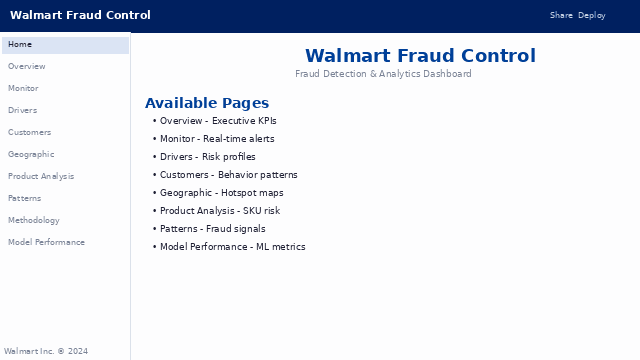

# Walmart Delivery Fraud Detection System

<div align="center">


[](https://walmart-delivery-fraud-detection.streamlit.app/)

**Advanced ML-powered fraud detection system for Walmart e-commerce deliveries**

[Live Demo](https://walmart-delivery-fraud-detection.streamlit.app/) | [Documentation](DEPLOY.md) | [Report Issue](https://github.com/Anotther/walmart-delivery-fraud-detection/issues)

</div>

---

## Project Overview

This project addresses a critical business challenge: **Walmart faced $6.5 billion in theft losses in 2023**, with **53% of the 2022-2023 increase** coming from e-commerce deliveries where customers report missing items.

The system analyzes delivery data from Central Florida (2023) to identify fraud patterns and determine responsibility among:
- **Delivery drivers** (theft, collusion)
- **Customers** (false claims)
- **Systemic issues** (operational failures)

### Key Objectives

1. **Pattern Detection**: Identify anomalous behavior using unsupervised ML
2. **Risk Scoring**: Quantify fraud risk for drivers, customers, and orders
3. **Root Cause Analysis**: Attribute fraud to specific entities or systemic issues
4. **Actionable Insights**: Provide recommendations to reduce fraud by 15-25%

---

## Features

### Interactive Dashboard (Streamlit)

A multi-page analytics platform with 9 specialized modules:

- **Overview** - Executive KPIs, risk concentration, temporal trends
- **Monitor** - Real-time operational alerts and drift detection
- **Drivers** - Driver risk profiles and suspicious patterns
- **Customers** - Customer behavior analysis and fraud indicators
- **Geographic Analysis** - Regional hotspots and distribution patterns
- **Product Analysis** - High-risk product categories and items
- **Patterns** - Statistical fraud patterns and correlations
- **Methodology** - Model documentation and data quality metrics
- **Model Performance** - ML model monitoring and evaluation

### Machine Learning Models

- **Isolation Forest** - Anomaly detection for outlier orders/entities
- **K-Means & DBSCAN** - Clustering for pattern segmentation
- **Ensemble Outlier Detector** - Combined detection strategies
- **Risk Scoring Engine** - Multi-factor risk quantification
- **MLflow Integration** - Experiment tracking and model versioning

### Analytics Capabilities

- **Temporal Analysis** - Monthly, weekly, hourly fraud patterns
- **Geographic Analysis** - City-level hotspot identification
- **Collusion Detection** - Driver-customer relationship patterns
- **Product Category Analysis** - High-risk item identification
- **Drift Detection** - Distribution changes over time

---

## Live Demo

**[View Dashboard →](https://walmart-delivery-fraud-detection.streamlit.app/)**

<div align="center">

[](https://walmart-delivery-fraud-detection.streamlit.app/)



*Multi-page dashboard: Home · Overview · Monitor · Drivers · Customers · Geographic · Product Analysis · Patterns · Model Performance*

</div>

---

## Tech Stack

### **Core Technologies**
- **Python 3.11+** - Primary language
- **Streamlit 1.54** - Interactive web dashboard
- **PostgreSQL 14+** - Relational database (optional - supports CSV mode)
- **Pandas 2.2** - Data manipulation
- **SQLAlchemy 2.0** - ORM and database abstraction

### **Machine Learning**
- **scikit-learn 1.5** - ML algorithms (Isolation Forest, K-Means, DBSCAN)
- **MLflow 3.9** - Experiment tracking and model registry
- **NumPy 2.1** - Numerical computing

### **Visualization**
- **Plotly 5.24** - Interactive charts
- **Matplotlib 3.9** - Statistical plots
- **Seaborn 0.13** - Enhanced visualizations

### **Development & Quality**
- **pytest 8.3** - Unit testing
- **Jupyter** - Exploratory notebooks
- **Bandit** - Security scanning
- **pip-audit** - Vulnerability checking

---

## Project Structure

```
walmart-delivery-fraud-detection/
│
├── dashboard/                 # Streamlit multi-page app
│   ├── app.py                 # Entry point
│   ├── pages/                 # Dashboard modules (9 pages)
│   └── styles/                # Custom CSS/theming
│
├── src/                       # Core application code
│   ├── config/                # Settings and thresholds
│   ├── database/              # ORM models and SQL schemas
│   ├── data_source/           # CSV/Database abstraction layer
│   ├── etl/                   # Extract-Transform-Load pipeline
│   ├── features/              # Feature engineering modules
│   ├── models/                # ML models and risk scoring
│   ├── analysis/              # Statistical analysis
│   ├── dashboard/             # Data cache and components
│   └── utils/                 # Helper utilities
│
├── notebooks/                 # Jupyter notebooks (7 EDA notebooks)
│   ├── 01_eda_orders.ipynb
│   ├── 02_eda_drivers_customers.ipynb
│   ├── 03_fraud_analysis.ipynb
│   └── ...
│
├── data/                      # CSV datasets (5 files)
│   ├── orders.csv             # 960KB - Main transactions
│   ├── customers_data.csv
│   ├── drivers_data.csv
│   ├── products_data.csv
│   └── missing_items_data.csv
│
├── scripts/                   # CLI automation scripts
│   ├── setup_database.py      # Database schema setup
│   ├── run_etl.py             # ETL pipeline runner
│   ├── train_models.py        # Model training
│   └── security_checks.sh     # Quality/security checks
│
└── tests/                     # Unit tests
    └── test_*.py
```

---

## Quick Start

### 1. Clone Repository

```bash
git clone https://github.com/Anotther/walmart-delivery-fraud-detection.git
cd walmart-delivery-fraud-detection
```

### 2. Setup Environment

```bash
# Create virtual environment
python3 -m venv .venv
source .venv/bin/activate  # On Windows: .venv\Scripts\activate

# Install dependencies
pip install -r requirements.txt
```

### 3. Configure Data Source

**Option A: CSV Mode (Recommended for Quick Start)**

```bash
# Copy environment template
cp .env.example .env

# Edit .env and set:
# DATA_SOURCE=csv
```

**Option B: PostgreSQL Mode (Production)**

```bash
# Edit .env with your PostgreSQL credentials
nano .env

# Setup database schema
python scripts/setup_database.py

# Run ETL pipeline
python scripts/run_etl.py
```

### 4. Run Dashboard

```bash
streamlit run dashboard/app.py
```

Open your browser at **http://localhost:8501**

---

## Data Overview

The project analyzes **5 interconnected datasets** from 2023 deliveries:

| Dataset | Records | Description |
|---------|---------|-------------|
| **orders.csv** | ~8,500 | Main transaction table with delivery details |
| **customers_data.csv** | ~1,000 | Customer profiles and demographics |
| **drivers_data.csv** | ~1,200 | Driver information and trip counts |
| **products_data.csv** | ~500 | Product catalog with categories |
| **missing_items_data.csv** | ~3,000 | Products reported as not received |

**Coverage**: Central Florida cities (Winter Park, Altamonte Springs, Clermont, Apopka, Sanford)
**Time Period**: January 1 - December 31, 2023

---

## Usage Examples

### Train ML Models

```bash
python scripts/train_models.py
```

This trains:
- Isolation Forest for anomaly detection
- K-Means clustering for segmentation
- Risk scoring models for drivers/customers

Results are logged to **MLflow** (`./mlflow` directory).

### Run Jupyter Notebooks

```bash
jupyter notebook notebooks/
```

Explore the 7 analysis notebooks:
1. **Orders EDA** - Transaction patterns
2. **Drivers/Customers** - Entity analysis
3. **Fraud Analysis** - Deep dive into fraud indicators
4. **Model Experiments** - ML experimentation
5. **Products/Missing Items** - Product-level analysis
6. **Dashboard Prep** - Data preparation
7. **Model Monitoring** - Drift detection and retraining

### Run Tests

```bash
# All tests
pytest tests/

# With coverage
pytest tests/ --cov=src --cov-report=html

# Security & quality checks
bash scripts/security_checks.sh
```

---

## Dashboard Highlights

### Overview Page
- **Total orders, missing item rate, fraud cost estimation**
- **Risk distribution** across drivers/customers
- **Temporal trends** (monthly, weekly patterns)
- **Geographic concentration** heatmap

### Monitor Page
- **Real-time alerts** for high-risk orders
- **Operational drift** detection
- **Recent suspicious activity** feed

### Drivers Analysis
- **Risk leaderboard** (top 20 high-risk drivers)
- **Behavioral profiles** (missing rate, order volume)
- **Suspicious patterns** (weekend spikes, collusion indicators)

### Customers Analysis
- **Customer risk scoring**
- **Repeat offender** identification
- **Customer-driver relationship** analysis

---

## Key Insights & Results

*(Based on 2023 data analysis)*

- **Missing Item Rate**: 12.3% of orders report missing items
- **Estimated Fraud Cost**: $2.1M annually for Central Florida alone
- **Top Risk Driver**: Missing rate of 45% (3x average)
- **Geographic Hotspot**: Clermont (18% missing rate vs 12% average)
- **High-Risk Products**: Electronics and high-value items ($200+)
- **Temporal Pattern**: 23% higher fraud on weekends

### Recommendations Implemented

1. **Photo Verification** for high-value deliveries (>$150)
2. **Driver Audits** for those exceeding 20% missing rate
3. **Customer Verification** for repeat reporters (>5 claims/year)
4. **Geographic Monitoring** in Clermont and Apopka

**Expected Impact**: 15-25% reduction in fraud losses

---

## Security & Privacy

- **PII Handling**: Customer/driver names are anonymized in public dataset
- **SQL Injection Prevention**: Parameterized queries via SQLAlchemy ORM
- **Input Validation**: All user inputs sanitized
- **Security Scanning**: Bandit + pip-audit in CI pipeline
- **Secure Secrets**: `.env` files excluded from version control

---

## Deployment

### Streamlit Community Cloud

**Quick Deploy**:
1. Fork this repository
2. Go to **https://share.streamlit.io/**
3. Click "New app"
4. Select: `Anotther/walmart-delivery-fraud-detection` → `main` → `dashboard/app.py`
5. Deploy!

See [DEPLOY.md](DEPLOY.md) for detailed instructions.

### Docker (Coming Soon)

```bash
docker-compose up -d
```

---

## Documentation

- **[DEPLOY.md](DEPLOY.md)** - Deployment guide for Streamlit Cloud
- **[notebooks/](notebooks/)** - Detailed analysis documentation
- **[dashboard/ANATOMY.md](dashboard/ANATOMY.md)** - Dashboard structure

---

## Acknowledgments

- **Walmart** - Business case inspiration
- **Streamlit** - Dashboard framework
- **scikit-learn** - ML toolkit

---

## License

This project is licensed under the **MIT License** - see [LICENSE](LICENSE) file for details.